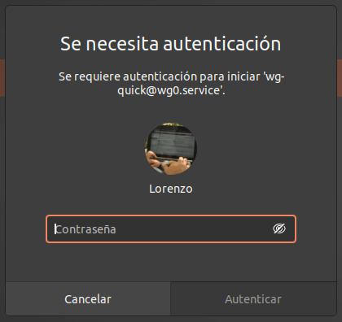
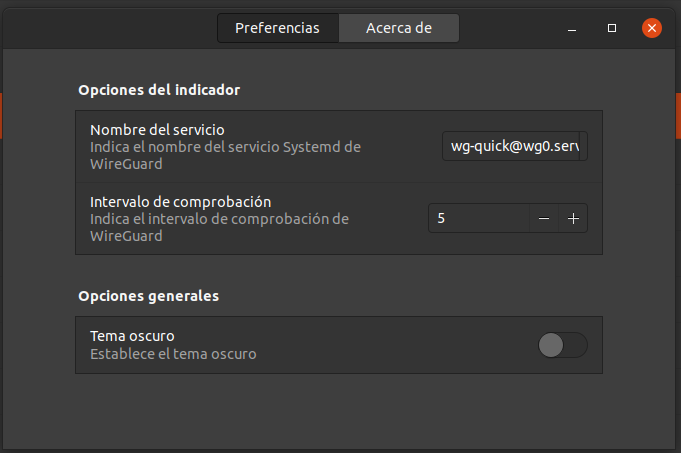

<!-- start project-info -->
<!--
project_title: WireGuard Indicator
github_project: https://github.com/atareao/wireguard-indicator
license: MIT
icon: /datos/Sync/Programacion/gnome-shell/wireguard-indicator@atareao.es/icons/wireguard-icon.svg
homepage: https://www.atareao.es/aplicacion/wireguard-indicator
license-badge: True
contributors-badge: True
lastcommit-badge: True
codefactor-badge: True
--->

<!-- end project-info -->

<!-- start badges -->


[](https://www.codefactor.io/repository/github/atareao/wireguard-indicator)
<!-- end badges -->

<!-- start description -->
<h1 align="center">Welcome to <span id="project_title">WireGuard Indicator</span> 👋</h1>
<p>
<a href="https://www.atareao.es/aplicacion/wireguard-indicator" id="homepage" rel="nofollow">

</a>
</p>
<h2>🏠 <a href="https://www.atareao.es/aplicacion/wireguard-indicator" id="homepage">Homepage</a></h2>
<p><span id="project_title">WireGuard Indicator</span> is a GNOME Shell indicator that shows the status of your WireGuard VPN.</p>
<p>WireGuard Indicator can enable or disable the WireGuard VPN by clicking on it.</p>
<p>You need superuser privileges (i.e. root access).</p>

<!-- end description -->

<!-- start prerequisites -->
## Prerequisites

You need WireGuard. To install it, simply type in the terminal:

```
sudo apt install wireguard
```

Of course, you need to [configure your beloved WireGuard first](https://www.wireguard.com/quickstart/).

<!-- end prerequisites -->

<!-- start installing -->
## Installing the <span id="project_title">WireGuard Indicator</span>

To install the <span id="project_title">WireGuard Indicator</span>, follow these steps:

Go to the [GNOME Extensions page](https://extensions.gnome.org/) and search for "[WireGuard Indicator](https://extensions.gnome.org/extension/3612/wireguard-indicator/)".

Enable the extension by clicking the switch.

<!-- end installing -->

## Setting Up

<span id="project_title">WireGuard Indicator</span> provide two ways to connect to your wireguard vpn:

- **nmcli**  
With `nmcli` we need to add our `wg.conf` file connection first by `sudo nmcli connection import type wireguard file /path/to/your/your-wg-file.conf`, since <span id="project_title">WireGuard Indicator</span> pick up the connection of `type=wireguard` they'll show up on the drop down and toggled right away after import (note: you may want to disable the auto connect via `nm-connection-editor` or your distro network setting).

- **systemd**  
Add wireguard to systemd by running `sudo systemctl enable wg-quick@yourconfig.service`, make sure you have your `/etc/wireguard/config.conf` in place.

<!-- start using -->
## Using <span id="project_title">WireGuard Indicator</span>

When you start **<span id="project_title">WireGuard Indicator</span>** it appears in the Indicator Area, as you can see in the next screenshot:


In this screenshot, the language is in Spanish. If there is no translation for your language, you can have the app in English.

If you enable on one of the WireGuard connections, a dialog will appear and ask you for your password to gain root privileges.



You can set additional options as you can see in next screenshot:



* Enable the dark theme for the WireGuard Indicator icon:


* Set the `systemd` service name
* Set the check time

<!-- end using -->

<!-- start contributing -->
## Contributing to <span id="project_title">WireGuard Indicator</span>

To contribute to **<span id="project_title">WireGuard Indicator</span>**, please follow these steps:

1. Fork this repository.
2. Create a branch: `git checkout -b <branch_name>`.
3. Make your changes and commit them: `git commit -m '<commit_message>'`
4. Push to the original branch: `git push origin atareao/readmemaker`
5. Create the pull request.

Alternatively see the GitHub documentation on [creating a pull request](https://help.github.com/en/github/collaborating-with-issues-and-pull-requests/creating-a-pull-request).

<!-- end contributing -->

<!-- start contributors -->
## 👤 Contributors ✨

Thanks goes to these wonderful people ([emoji key](https://allcontributors.org/docs/en/emoji-key)):


<!-- end contributors -->

<!-- start table-contributors -->

<table id="contributors">
	<tr id="info_avatar">
		<td id="atareao" align="center">
			<a href="https://github.com/atareao">
				
			</a>
		</td>
		<td id="dtalens" align="center">
			<a href="https://github.com/dtalens">
				
			</a>
		</td>
	</tr>
	<tr id="info_name">
		<td id="atareao" align="center">
			<a href="https://github.com/atareao">
				<strong>Lorenzo Carbonell</strong>
			</a>
		</td>
		<td id="dtalens" align="center">
			<a href="https://github.com/dtalens">
				<strong>dtalens</strong>
			</a>
		</td>
	</tr>
	<tr id="info_commit">
		<td id="atareao" align="center">
			<a href="/commits?author=atareao">
				<span id="role">💻</span>
			</a>
		</td>
		<td id="dtalens" align="center">
			<a href="/commits?author=dtalens">
				<span id="role">🌍</span>
			</a>
		</td>
	</tr>
</table>
<!-- end table-contributors -->
